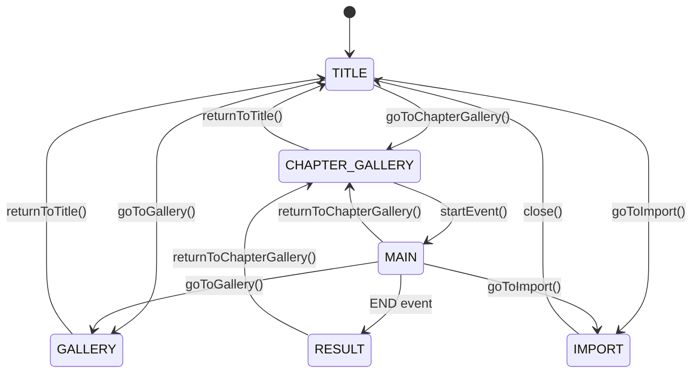

# データ構造＆API仕様書

本ドキュメントは、ノベルゲームアプリケーションのデータ構造とAPI仕様をまとめた引継ぎ資料です。

---

## 目次

1. [データファイル概要](#データファイル概要)
2. [episodes.json 仕様](#episodesjson-仕様)
3. [scenario.json 仕様](#scenariojson-仕様)
4. [gallery.json 仕様](#galleryjson-仕様)
5. [状態管理仕様](#状態管理仕様)
6. [API仕様](#api仕様)
7. [PWA実装ガイド](#pwa実装ガイド)

---

## データファイル概要

### ファイル構成

```
data/
├─ episodes.json    # エピソード・チャプター・イベント構成
├─ scenario.json    # シナリオノード（会話・選択肢・演出）
└─ gallery.json     # ギャラリー画像メタデータ
```

### 読み込みタイミング

- **初期化時**: `initGame()` で3ファイルを並列読み込み（`Promise.all`）
- **エラーハンドリング**: ローカルファイル実行時のCORSエラーを考慮し、エラーメッセージを表示

---

## episodes.json 仕様

### 概要

エピソード → チャプター → イベント の階層構造を定義。

### データ構造

```typescript
interface EpisodesData {
  episodes: Episode[];
}

interface Episode {
  id: string;           // 例: "ep1"
  title: string;        // 例: "Episode 1"
  chapters: Chapter[];
}

interface Chapter {
  id: string;           // 例: "ep1-ch1"
  title: string;        // 例: "第一章：魔法の塔"
  events: Event[];
}

interface Event {
  id: string;           // 例: "event-1"
  title: string;        // 例: "塔の扉"
  description: string;  // 例: "魔法の塔の入り口で..."
  startStoryID: number; // scenario.jsonのstoryIDに対応
}
```

### サンプルデータ

```json
{
  "episodes": [
    {
      "id": "ep1",
      "title": "Episode 1",
      "chapters": [
        {
          "id": "ep1-ch1",
          "title": "第一章：魔法の塔",
          "events": [
            {
              "id": "event-1",
              "title": "塔の扉",
              "description": "魔法の塔の入り口で何かが動いた。",
              "startStoryID": 1100
            }
          ]
        }
      ]
    }
  ]
}
```

### 使用箇所

- **ChapterGalleryScreen**: サイドパネルのエピソード・チャプター一覧
- **EventCard**: メインエリアのイベント一覧表示

---

## scenario.json 仕様

### 概要

ゲームの実際のシナリオフロー（会話、選択肢、演出）を線形リストで定義。

### データ構造

```typescript
interface ScenarioData {
  meta: {
    title: string;
    type: string;
    version: string;
  };
  scenario: ScenarioNode[];
}

interface ScenarioNode {
  storyID: number;           // 一意のID
  scene?: number;            // シーン番号（任意）
  type?: NodeType;           // ノードタイプ
  speaker?: string;          // 話者名
  text?: string;             // セリフテキスト
  tags?: string[];           // キャラクター表示タグ等
  sceneTags?: string[];      // 背景タグ
  event?: Event;             // イベント定義
  flags?: Record<string, any>; // フラグ設定
  note?: string;             // 開発メモ
}

type NodeType = 
  | 'SCENE_START'  // シーン開始（背景切替）
  | 'DIALOG'       // 通常会話（デフォルト）
  | 'END';         // エンディング

interface Event {
  type: EventType;
  payload: any;
}

type EventType =
  | 'TAP_NEXT'   // 次の行へ進む
  | 'CHOICE'     // 選択肢表示
  | 'END';       // ゲーム終了

// CHOICE イベントのペイロード
interface ChoicePayload {
  choices: Choice[];
}

interface Choice {
  label: string;       // 選択肢テキスト
  nextStoryID: number; // 選択後のジャンプ先
}
```

### ノード種類と動作

#### 1. SCENE_START (シーン開始)
```json
{
  "storyID": 1100,
  "type": "SCENE_START",
  "sceneTags": ["bg_magic_tower_interior_1280x720"],
  "note": "Chapter1開始"
}
```
- **動作**: 背景を切り替え、次のノードへ自動遷移（500ms後）
- **sceneTagsの使用**: 背景クラス名生成（例: `bg-magic-tower`）

#### 2. DIALOG (通常会話)
```json
{
  "storyID": 1110,
  "speaker": "理の魔法使い",
  "text": "ここへ来た理由は、理を求めたからだろう。",
  "tags": ["chara_mage_calm_512x768"]
}
```
- **動作**: テキストをタイプライター表示、クリックで次へ
- **tagsの使用**: キャラクター表示（例: `chara_mage` → 🧙）

#### 3. TAP_NEXT イベント
```json
{
  "storyID": 1130,
  "event": {
    "type": "TAP_NEXT",
    "payload": {
      "nextStoryID": 1200
    }
  }
}
```
- **動作**: クリックで指定IDへジャンプ

#### 4. CHOICE イベント（選択肢）
```json
{
  "storyID": 1220,
  "event": {
    "type": "CHOICE",
    "payload": {
      "choices": [
        { "label": "力の理", "nextStoryID": 1300 },
        { "label": "調和の理", "nextStoryID": 1301 }
      ]
    }
  }
}
```
- **動作**: テキスト完了後、選択肢ボタン表示

#### 5. END イベント（エンディング）
```json
{
  "storyID": 1420,
  "event": {
    "type": "END",
    "payload": {
      "goto": "RESULT"
    }
  },
  "flags": {
    "trusted_reason": true
  }
}
```
- **動作**: flagsを保存し、RESULT画面へ遷移

### シナリオフロー制御

```javascript
// 現在のノードから次のノードへ
const currentIndex = scenario.findIndex(n => n.storyID === currentStoryID);
const nextNode = scenario[currentIndex + 1];
```

---

## gallery.json 仕様

### 概要

ギャラリー画面で表示する画像のメタデータ。

### データ構造

```typescript
interface GalleryData {
  images: GalleryImage[];
}

interface GalleryImage {
  id: string;           // 一意のID
  title: string;        // 画像タイトル
  description: string;  // 説明文
  tags: string[];       // タグ（フィルタリング用）
  src: string;          // 画像パス
  isDeleted: boolean;   // ゴミ箱フラグ
}
```

### サンプルデータ

```json
{
  "images": [
    {
      "id": "img-001",
      "title": "魔法の塔",
      "description": "理を求める者が訪れる塔",
      "tags": ["風景", "建物"],
      "src": "assets/bg/tower.png",
      "isDeleted": false
    }
  ]
}
```

### データ操作

- **追加**: Drag & Drop → モーダルでメタデータ入力 → `images`配列に追加
- **編集**: メニュー → モーダルで編集 → 該当オブジェクト更新
- **削除**: `isDeleted: true` に設定（物理削除ではない）
- **フィルタリング**: `selectedTags`で絞り込み

---

## 状態管理仕様

### gameState オブジェクト

```typescript
interface GameState {
  // 画面遷移
  screen: ScreenType;
  
  // メインゲーム
  currentStoryID: number;
  currentSceneTags: string[];
  flags: Record<string, any>;
  isTextComplete: boolean;
  displayText: string;
  fullText: string;
  
  // チャプターギャラリー
  selectedChapter: string;
  isPanelOpen: boolean;
  
  // メニュー
  isMenuOpen: boolean;
  
  // ギャラリー
  selectedTags: string[];
  isDragging: boolean;
  openMenuId: string | null;
  modalData: GalleryImage | null;
}

type ScreenType = 
  | 'TITLE'
  | 'CHAPTER_GALLERY'
  | 'MAIN'
  | 'RESULT'
  | 'GALLERY'
  | 'IMPORT';
```

### 画面遷移フロー



---

## API仕様

### 1. Dropbox API

#### 認証フロー

```javascript
// 1. 認証URL取得
const dbx = new Dropbox.Dropbox({ clientId: APP_KEY });
const authUrl = await dbx.auth.getAuthenticationUrl(redirectUri);

// 2. ユーザーをDropboxへリダイレクト
window.location.href = authUrl;

// 3. コールバック処理（リダイレクト後）
const hash = window.location.hash.substring(1);
const params = new URLSearchParams(hash);
const token = params.get('access_token');

// 4. Dropboxクライアント初期化
const dbx = new Dropbox.Dropbox({ accessToken: token });
```

#### ファイル一覧取得

```javascript
const response = await dbx.filesListFolder({ path: '/GameAssets' });
const entries = response.result.entries;

// entries: { '.tag': 'folder' | 'file', name, path_lower, ... }
```

#### ファイルダウンロード

```javascript
const response = await dbx.filesDownload({ path: entry.path_lower });
const blob = response.result.fileBlob;
```

### 2. Cache Storage API

#### アセット保存

```javascript
const cache = await caches.open('imported-assets-v1');
const virtualPath = `/assets/${category}/${filename}`;
const responseToCache = new Response(blob, {
  headers: { 'Content-Type': blob.type }
});
await cache.put(virtualPath, responseToCache);
```

#### アセット一覧取得

```javascript
const cache = await caches.open('imported-assets-v1');
const keys = await cache.keys();
// keys: Request[]
```

#### アセット削除

```javascript
const cache = await caches.open('imported-assets-v1');
await cache.delete(request);
```

#### Service Workerでの配信

```javascript
// sw.js
self.addEventListener('fetch', (event) => {
  if (url.pathname.includes('/assets/')) {
    event.respondWith(
      caches.open('imported-assets-v1').then((cache) => {
        return cache.match(event.request).then((response) => {
          return response || new Response('Asset not found', { status: 404 });
        });
      })
    );
  }
});
```

---

## PWA実装ガイド

### Service Worker (sw.js)

#### キャッシュ戦略

- **アプリケーションシェル**: Network First（`novel-game-v4`）
- **インポートアセット**: Cache Only（`imported-assets-v1`）

#### キャッシュ更新

```javascript
// バージョンアップ時
const CACHE_NAME = 'novel-game-v5'; // ← 数字を変更

// 古いキャッシュ削除
self.addEventListener('activate', (event) => {
  event.waitUntil(
    caches.keys().then((cacheNames) => {
      return Promise.all(
        cacheNames.map((cacheName) => {
          if (cacheName !== CACHE_NAME && cacheName !== 'imported-assets-v1') {
            return caches.delete(cacheName);
          }
        })
      );
    })
  );
});
```

### manifest.json

```json
{
  "name": "理の魔法使い",
  "short_name": "理の魔法使い",
  "start_url": "./",
  "display": "standalone",
  "background_color": "#0a0a0a",
  "theme_color": "#d4af37",
  "icons": [
    {
      "src": "icons/icon-192.png",
      "sizes": "192x192",
      "type": "image/png"
    },
    {
      "src": "icons/icon-512.png",
      "sizes": "512x512",
      "type": "image/png"
    }
  ]
}
```

### Service Worker登録

```html
<script>
if ('serviceWorker' in navigator) {
  window.addEventListener('load', () => {
    navigator.serviceWorker.register('./sw.js')
      .then(registration => {
        console.log('SW registered:', registration.scope);
      })
      .catch(err => {
        console.log('SW registration failed:', err);
      });
  });
}
</script>
```

---

## 補足: タグ命名規則

### 背景タグ（sceneTags）

```
bg_<場所>_<詳細>_<解像度>

例:
- bg_magic_tower_interior_1280x720
- bg_magic_circle_1920x1080
```

### キャラクタータグ（tags）

```
chara_<キャラクター名>_<表情>_<解像度>

例:
- chara_mage_calm_512x768
- chara_familiar_happy_512x768
```

### ギャラリータグ

```
任意の日本語タグ

例:
- 風景
- キャラクター
- アイテム
```

---

## React移行時の推奨実装

### 1. データフェッチ

```tsx
const useGameData = () => {
  const [data, setData] = useState(null);
  const [loading, setLoading] = useState(true);
  const [error, setError] = useState(null);
  
  useEffect(() => {
    Promise.all([
      fetch('/data/episodes.json').then(r => r.json()),
      fetch('/data/scenario.json').then(r => r.json()),
      fetch('/data/gallery.json').then(r => r.json())
    ])
    .then(([episodes, scenario, gallery]) => {
      setData({ episodes, scenario, gallery });
      setLoading(false);
    })
    .catch(err => {
      setError(err);
      setLoading(false);
    });
  }, []);
  
  return { data, loading, error };
};
```

### 2. シナリオ進行

```tsx
const useScenarioProgress = (scenario: ScenarioNode[]) => {
  const [currentStoryID, setCurrentStoryID] = useState(1100);
  
  const currentNode = scenario.find(n => n.storyID === currentStoryID);
  const currentIndex = scenario.findIndex(n => n.storyID === currentStoryID);
  const nextNode = scenario[currentIndex + 1];
  
  const goToNext = () => {
    if (nextNode) {
      setCurrentStoryID(nextNode.storyID);
    }
  };
  
  const jumpTo = (storyID: number) => {
    setCurrentStoryID(storyID);
  };
  
  return { currentNode, goToNext, jumpTo };
};
```

### 3. Dropbox連携

```tsx
const useDropbox = () => {
  const [dbx, setDbx] = useState<Dropbox | null>(null);
  const [isAuthenticated, setIsAuthenticated] = useState(false);
  
  const authenticate = async () => {
    const dbxClient = new Dropbox.Dropbox({ clientId: APP_KEY });
    const authUrl = await dbxClient.auth.getAuthenticationUrl(window.location.href);
    window.location.href = authUrl;
  };
  
  const checkAuth = () => {
    const hash = window.location.hash.substring(1);
    const params = new URLSearchParams(hash);
    const token = params.get('access_token');
    
    if (token) {
      const dbxClient = new Dropbox.Dropbox({ accessToken: token });
      setDbx(dbxClient);
      setIsAuthenticated(true);
      window.history.replaceState({}, document.title, window.location.pathname);
    }
  };
  
  return { dbx, isAuthenticated, authenticate, checkAuth };
};
```

---

以上が、ノベルゲームアプリケーションのデータ構造とAPI仕様書です。React移行時の参考にしてください。
