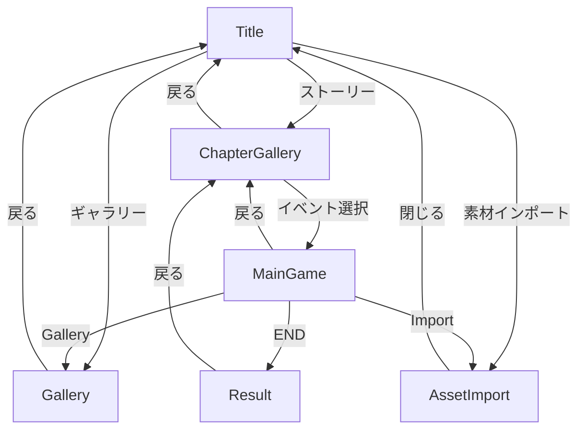

# ノベルゲームReact化レイアウト資料

このドキュメントは、現在のVanilla JS実装のノベルゲームをReact + Viteプロジェクトに移植するための包括的なレイアウト資料です。

## 目次

- [全体構成](#全体構成)
- [デザイントークン](#デザイントークン)
- [画面一覧](#画面一覧)
  - [1. タイトル画面](#1-タイトル画面)
  - [2. チャプターギャラリー画面](#2-チャプターギャラリー画面)
  - [3. メインゲーム画面](#3-メインゲーム画面)
  - [4. リザルト画面](#4-リザルト画面)
  - [5. ギャラリー画面](#5-ギャラリー画面)
  - [6. 素材インポート画面](#6-素材インポート画面)
- [React推奨コンポーネント構成](#react推奨コンポーネント構成)

---

## 全体構成

### アプリケーション構造

```
├─ App (ルートコンポーネント)
│   ├─ TitleScreen
│   ├─ ChapterGalleryScreen
│   ├─ MainGameScreen
│   ├─ ResultScreen
│   ├─ GalleryScreen
│   └─ AssetImportScreen
```

### 画面遷移フロー



### 状態管理

**推奨**: Context API または Zustand

```typescript
interface GameState {
  screen: 'TITLE' | 'CHAPTER_GALLERY' | 'MAIN' | 'RESULT' | 'GALLERY' | 'IMPORT';
  currentStoryID: number;
  currentSceneTags: string[];
  flags: Record<string, any>;
  selectedChapter: string;
  isPanelOpen: boolean;
  isMenuOpen: boolean;
  selectedTags: string[];
  // ... その他
}
```

---

## デザイントークン

### カラーパレット

```css
:root {
  /* 背景色 */
  --color-bg-dark: #0a0a0a;
  --color-bg-panel: #1a1a1a;
  --color-bg-gradient-start: #111;
  --color-bg-gradient-end: #1a1a1a;
  
  /* テキスト */
  --color-text-main: #e0e0e0;
  --color-text-accent: #d4af37; /* ゴールド */
  --color-text-muted: #888;
  
  /* アクセント */
  --color-primary: #3d3d3d;
  --color-active: #5d5d5d;
  --color-border: #333;
  --color-border-light: rgba(255, 255, 255, 0.1);
}
```

### タイポグラフィ

```css
--font-main: "Helvetica Neue", Arial, "Hiragino Kaku Gothic ProN", Meiryo, sans-serif;

/* サイズ */
--font-size-xs: 0.85rem;
--font-size-sm: 0.9rem;
--font-size-base: 1rem;
--font-size-lg: 1.2rem;
--font-size-xl: 1.5rem;
--font-size-2xl: 2.5rem;
--font-size-3xl: 3rem;
```

### スペーシング

```css
--spacing-xs: 0.5rem;
--spacing-sm: 1rem;
--spacing-md: 1.5rem;
--spacing-lg: 2rem;
--spacing-xl: 3rem;
--spacing-2xl: 4rem;
```

---

## 画面一覧

## 1. タイトル画面

### レイアウト

```
┌────────────────────────────────────┐
│                                    │
│                                    │
│         理の魔法使い                │
│                                    │
│       ┌──────────────┐            │
│       │  ストーリー  │            │
│       └──────────────┘            │
│       ┌──────────────┐            │
│       │ ギャラリー   │            │
│       └──────────────┘            │
│       ┌──────────────┐            │
│       │素材インポート│            │
│       └──────────────┘            │
│                                    │
└────────────────────────────────────┘
```

### UI要素

#### `.title-screen` (コンテナ)
- **サイズ**: 100vw × 100vh
- **表示**: flex (中央揃え)
- **背景**: `radial-gradient(circle at center, #2a2a2a, #000)`

#### `.game-title` (タイトル)
- **テキスト**: "理の魔法使い"
- **スタイル**:
  - フォントサイズ: 3rem
  - カラー: `var(--color-text-accent)` (#d4af37)
  - テキストシャドウ: `0 0 10px rgba(212, 175, 55, 0.5)`
  - マージン下: 2rem

#### `.start-button` (ボタン × 3)
- **ラベル**:
  1. "ストーリー"
  2. "ギャラリー"
  3. "素材インポート" (小さめ、青枠)
- **スタイル**:
  - パディング: 1rem 3rem
  - フォントサイズ: 1.5rem
  - 背景: transparent
  - ボーダー: 2px solid `var(--color-text-accent)`
  - カラー: `var(--color-text-accent)`
  - ホバー: 背景がゴールド、テキストが黒に反転

### インタラクション

- **ストーリーボタン**: `goToChapterGallery()`
- **ギャラリーボタン**: `goToGallery()`
- **素材インポートボタン**: `goToImport()`

### React実装例

```tsx
const TitleScreen = () => {
  const { setScreen, setSelectedChapter } = useGameStore();
  
  return (
    <div className="title-screen">
      <div className="title-content">
        <h1 className="game-title">理の魔法使い</h1>
        <div className="title-buttons">
          <button onClick={() => { setScreen('CHAPTER_GALLERY'); }}>
            ストーリー
          </button>
          <button onClick={() => setScreen('GALLERY')}>
            ギャラリー
          </button>
          <button className="import-btn" onClick={() => setScreen('IMPORT')}>
            素材インポート
          </button>
        </div>
      </div>
    </div>
  );
};
```

---

## 2. チャプターギャラリー画面

### レイアウト

```
┌──────────┬───────────────────────────┐
│ Episode1 │  Episode 1                │
│  Ch1 ✓   │  第一章：魔法の塔         │
│  Ch2     │  ───────────────────      │
│          │ ┌─────────┐ ┌─────────┐  │
│ Episode2 │ │Event 1  │ │Event 2  │  │
│  Ch1     │ │説明文   │ │説明文   │  │
│  Ch2     │ │[読む]   │ │[読む]   │  │
│          │ └─────────┘ └─────────┘  │
│  [◀]     │                           │
└──────────┴───────────────────────────┘
```

### UI要素

#### `.chapter-gallery-screen` (コンテナ)
- **サイズ**: 100vw × 100vh
- **表示**: flex (横並び)
- **背景**: #111

#### `.side-panel` (サイドパネル)
- **幅**: 300px (閉じた状態: 0px)
- **背景**: `var(--color-bg-panel)` (#1a1a1a)
- **ボーダー右**: 1px solid #333
- **トランジション**: width 0.3s ease

**サイドパネル内容**:
- `.side-panel-header`: ヘッダー（タイトル等）
- `.stepper-container`: エピソード・チャプターリスト
  - `.episode-item`: エピソードグループ
    - `.episode-header`: エピソードタイトル
    - `.chapter-list`: チャプター一覧
      - `.chapter-item`: 各チャプター
      - `.chapter-item.active`: 選択中（ゴールド枠＋背景）

#### `.toggle-panel-btn` (開閉ボタン)
- **位置**: サイドパネル右端（絶対配置）
- **サイズ**: 24px × 48px
- **アイコン**: ◀ / ▶

#### `.main-content-area` (メインエリア)
- **Flex**: 1
- **パディング**: 3rem 4rem
- **背景**: `linear-gradient(135deg, #111 0%, #1a1a1a 100%)`
- **スクロール**: 縦

**メインエリア内容**:
- `.chapter-title-section`: チャプタータイトル部
  - `.chapter-subtitle`: エピソード名（ゴールド）
  - `.chapter-main-title`: チャプター名（2.5rem）
- `.events-grid`: イベントカードグリッド
  - Grid: `repeat(auto-fill, minmax(280px, 1fr))`
  - Gap: 2rem
  - `.event-card`: 各イベントカード
    - `.event-title`: イベント名
    - `.event-description`: 説明文
    - `.event-read-btn`: 「読む」ボタン

### インタラクション

- **チャプター選択**: `selectChapter(chapterId)` → 右側のイベント一覧を更新
- **開閉ボタン**: `togglePanel()` → サイドパネルの表示/非表示
- **イベント読むボタン**: `startEvent(startStoryID)` → メインゲーム画面へ遷移

### React実装例

```tsx
const ChapterGalleryScreen = () => {
  const { selectedChapter, isPanelOpen, episodes } = useGameStore();
  
  return (
    <div className="chapter-gallery-screen">
      <SidePanel 
        isOpen={isPanelOpen}
        episodes={episodes}
        selectedChapter={selectedChapter}
      />
      <MainContentArea 
        selectedChapter={selectedChapter}
      />
    </div>
  );
};
```

---

## 3. メインゲーム画面

### レイアウト

```
┌────────────────────────────────────┐
│ ←戻る    📷 ☁️ 📦 メニュー        │ ← ヘッダー
│                                    │
│                                    │
│         🧙 (キャラクター)          │
│                                    │
│                                    │
│  ┌──────────────────────────┐    │
│  │ 魔法使い                  │    │
│  │ セリフテキスト...         │    │
│  │                       ▼  │    │ ← メッセージウィンドウ
│  └──────────────────────────┘    │
└────────────────────────────────────┘
```

### UI要素

#### `.main-game-screen` (コンテナ)
- **サイズ**: 100vw × 100vh
- **位置**: relative
- **背景**: #000

#### `.background-layer` (背景レイヤー)
- **位置**: absolute (全画面)
- **トランジション**: opacity 1s
- **バリエーション**:
  - `.bg-black`: 黒背景
  - `.bg-magic-tower`: 魔法の塔（紫グラデーション）
  - `.bg-magic-circle`: 魔法陣（青グラデーション）

#### `.game-header` (ヘッダー)
- **位置**: absolute top
- **パディング**: 1rem 2rem
- **表示**: flex (space-between)
- **z-index**: 100
- **Pointer Events**: none（子要素のボタンは auto）

**ヘッダーボタン** (`.header-btn`):
- 左側: 戻るボタン（`arrow_back` アイコン）
- 右側: 
  - ギャラリー（`photo_library`）
  - インポート（`cloud_download`）
  - アイテム（`inventory_2`）
  - メニュー（`menu`）
- **スタイル**:
  - 背景: `rgba(0, 0, 0, 0.5)`
  - ボーダー: 1px solid `rgba(255, 255, 255, 0.2)`
  - パディング: 0.5rem 1rem
  - ホバー: 背景が明るくなる

#### `.character-layer` (キャラクターレイヤー)
- **位置**: absolute bottom
- **高さ**: 100%
- **表示**: flex (中央下揃え)
- **Pointer Events**: none
- `.character-sprite`: キャラクタースプライト
  - フォントサイズ: 15rem（絵文字）
  - アニメーション: float（上下に浮遊）

#### `.message-window` (メッセージウィンドウ)
- **位置**: absolute bottom 2rem (中央)
- **幅**: 80% (max 1000px)
- **高さ**: 180px
- **背景**: `rgba(0, 0, 0, 0.85)`
- **ボーダー**: 1px solid #444
- **パディング**: 1.5rem 2rem
- **カーソル**: pointer

**メッセージ内容**:
- `.speaker-name`: 話者名（ゴールド、bold）
- `.message-text`: セリフテキスト（1.2rem）
  - `.next-indicator`: 次へアイコン（▼、点滅）

#### `.choice-container` (選択肢コンテナ)
- **位置**: absolute 中央
- **幅**: 400px
- **表示**: flex column
- **Gap**: 1rem
- `.choice-button`: 各選択肢ボタン
  - 背景: `rgba(0, 0, 0, 0.9)`
  - ボーダー: 1px solid `var(--color-text-accent)`
  - ホバー: 背景がゴールド、テキストが黒

#### `.menu-modal-overlay` (メニューモーダル)
- **位置**: fixed 全画面
- **背景**: `rgba(0, 0, 0, 0.7)` + backdrop-filter blur
- **z-index**: 200
- `.menu-modal-content`: モーダル本体
  - 幅: 300px
  - パディング: 2rem
  - 背景: `var(--color-bg-panel)`
  - ボーダー: 1px solid #555

### インタラクション

- **メッセージクリック**: 
  - テキスト未完了 → 即座に全文表示
  - テキスト完了 → 次の行へ
  - 選択肢表示中 → 何もしない
- **選択肢ボタン**: `selectChoice(nextStoryID)` → 次のストーリーへ
- **メニューボタン**: `toggleMenuModal()` → モーダル表示/非表示
- **タイトルに戻る**: `returnToTitle()`

### React実装例

```tsx
const MainGameScreen = () => {
  const { currentStoryID, currentSceneTags, displayText, isTextComplete } = useGameStore();
  const node = scenario.find(n => n.storyID === currentStoryID);
  
  return (
    <div className="main-game-screen">
      <BackgroundLayer tags={currentSceneTags} />
      <GameHeader />
      <CharacterLayer tags={node.tags} />
      <MessageWindow 
        speaker={node.speaker}
        text={displayText}
        isComplete={isTextComplete}
      />
      {node.event?.type === 'CHOICE' && isTextComplete && (
        <ChoiceContainer choices={node.event.payload.choices} />
      )}
      <MenuModal />
    </div>
  );
};
```

---

## 4. リザルト画面

### レイアウト

```
┌────────────────────────────────────┐
│                                    │
│                                    │
│          真理への道                 │
│                                    │
│   理の魔法使いは、論理の力で        │
│    謎を解いた。                    │
│                                    │
│    ┌────────────────────┐         │
│    │チャプター選択に戻る│         │
│    └────────────────────┘         │
│                                    │
└────────────────────────────────────┘
```

### UI要素

#### `.result-screen` (コンテナ)
- **サイズ**: 100vw × 100vh
- **表示**: flex (中央揃え)
- **背景**: #000

#### `.result-content`
- **最大幅**: 600px
- **テキスト整列**: center

**内容**:
- `.result-title`: 結果タイトル（2.5rem、ゴールド）
  - 条件分岐: `flags.trusted_reason` によって表示内容変更
- `.result-message`: メッセージ（1.2rem、3rem下マージン）
- `.return-button`: 戻るボタン

### インタラクション

- **戻るボタン**: `returnToChapterGallery()` → チャプターギャラリー画面へ

### React実装例

```tsx
const ResultScreen = () => {
  const { flags, setScreen } = useGameStore();
  const isTrustedEnding = flags.trusted_reason;
  
  return (
    <div className="result-screen">
      <div className="result-content">
        <h2 className="result-title">
          {isTrustedEnding ? '真理への道' : 'エンディング'}
        </h2>
        <p className="result-message">
          {isTrustedEnding 
            ? '理の魔法使いは、論理の力で謎を解いた。'
            : '物語は終わりを迎えた。'}
        </p>
        <button onClick={() => setScreen('CHAPTER_GALLERY')}>
          チャプター選択に戻る
        </button>
      </div>
    </div>
  );
};
```

---

## 5. ギャラリー画面

### レイアウト

```
┌────────────────────────────────────┐
│ ギャラリー    🗑️ ➕画像 [戻る]     │ ← ヘッダー
├────────────────────────────────────┤
│  [風景] [キャラ] [アイテム] ...   │ ← タグエリア（2列）
├────────────────────────────────────┤
│ ┌────┐ ┌────┐ ┌────┐ ┌────┐     │
│ │画像│ │画像│ │画像│ │画像│     │
│ │ 1  │ │ 2  │ │ 3  │ │ 4  │     │
│ └────┘ └────┘ └────┘ └────┘     │ ← 画像グリッド
│ ┌────┐ ┌────┐                   │
│ │画像│ │画像│                   │
│ │ 5  │ │ 6  │                   │
│ └────┘ └────┘                   │
└────────────────────────────────────┘
```

### UI要素

#### `.gallery-screen` (コンテナ)
- **サイズ**: 100vw × 100vh
- **表示**: flex column
- **背景**: `linear-gradient(180deg, #0f0f0f 0%, #1a1a1a 100%)`

#### `.gallery-header` (ヘッダー)
- **パディング**: 1.5rem 2rem
- **背景**: #0a0a0a
- **ボーダー下**: 2px solid #d4af37
- **表示**: flex (space-between)

**ヘッダー内容**:
- 左側: `.gallery-main-title` ("ギャラリー", 1.8rem)
- 右側: `.gallery-actions`
  - ゴミ箱ボタン (`.trash-btn`, 🗑️)
  - 画像追加ボタン (`.add-image-btn`, ➕)
  - 戻るボタン (`.back-btn`)

#### `.tags-area` (タグエリア)
- **パディング**: 2rem
- **背景**: `linear-gradient(180deg, #1a1a1a 0%, #0f0f0f 100%)`
- **高さ**: 180px～250px
- **スクロール**: 縦

`.tags-grid`: タググリッド
- **Grid**: `repeat(2, 1fr)` (2列)
- **Gap**: 1rem
- `.tag-item`: 各タグ
  - パディング: 0.8rem 1.5rem
  - 背景: #1a1a1a
  - ボーダー: 2px solid #3a3a3a
  - ホバー: 背景・ボーダー色変更
  - **選択時** (`.selected`):
    - ボーダー: 3px solid #d4af37
    - カラー: #d4af37
    - シャドウ: 0 0 15px rgba(212, 175, 55, 0.3)

#### `.gallery-content` (メインコンテンツ)
- **Flex**: 1
- **スクロール**: 縦
- **パディング**: 2rem

`.images-grid`: 画像グリッド
- **Grid**: `repeat(auto-fill, minmax(280px, 1fr))`
- **Gap**: 2rem
- `.image-card`: 各画像カード
  - **構成**:
    - `.image-card-header`: ヘッダー
      - `.image-card-title`: タイトル
      - `.image-card-menu-btn`: ⋮ メニューボタン
      - `.image-menu-dropdown`: ドロップダウン（絶対配置）
        - `.menu-item`: "編集" / "削除"
    - `.image-card-img`: 画像エリア（200px高さ）
      - `img`: 実際の画像
    - `.image-card-desc`: 説明文エリア

#### ドラッグ＆ドロップオーバーレイ (`.drop-overlay`)
- **位置**: fixed 全画面
- **背景**: `rgba(212, 175, 55, 0.9)`
- **z-index**: 300
- **表示**: ドラッグ中のみ

#### モーダル (`.image-modal-overlay`)
- **位置**: fixed 全画面
- **背景**: `rgba(0, 0, 0, 0.8)` + backdrop-filter
- `.image-modal-content`: モーダル本体
  - フォーム: タイトル / 説明 / タグ（カンマ区切り）
  - ボタン: 保存 / キャンセル

### インタラクション

- **タグ選択**: `toggleTag(tag)` → フィルタリング
- **画像追加**: Drag & Drop → ファイル読み込み → モーダル表示
- **メニュー編集**: モーダルでデータ編集
- **メニュー削除**: ゴミ箱に移動（実装ではフラグ変更）
- **ゴミ箱ボタン**: ゴミ箱内表示モードに切替
- **戻るボタン**: `returnToTitle()`

### React実装例

```tsx
const GalleryScreen = () => {
  const { images, selectedTags, isDragging } = useGallery();
  
  return (
    <div className="gallery-screen">
      <GalleryHeader />
      <TagsArea tags={getAllTags(images)} />
      <GalleryContent images={filterImagesByTags(images, selectedTags)} />
      {isDragging && <DropOverlay />}
      <ImageModal />
    </div>
  );
};
```

---

## 6. 素材インポート画面

### レイアウト

```
┌────────────────────────────────────┐
│ 素材インポート      [接続] [閉じる]│ ← ヘッダー
├─────────────────┬──────────────────┤
│ Dropbox(Reader) │  Local Assets    │
│ 更新             │  更新             │
│ /GameAssets     │                  │
│ ┌────┐ ┌────┐ │ ┌────┐ ┌────┐   │
│ │📁  │ │📁  │ │ │[bg]│ │[bg]│   │
│ │01_b│ │02_c│ │ │img1│ │img2│   │
│ └────┘ └────┘ │ │[追 ]│ │[削除]│   │
│ ┌────┐ ┌────┐ │ └────┘ └────┘   │
│ │📄  │ │📄  │ │                  │
│ │pic │ │pic2│ │                  │
│ │[追加│ │[追加│ │                  │
│ └────┘ └────┘ │                  │
└─────────────────┴──────────────────┘
```

### UI要素

#### `.asset-import-screen` (コンテナ)
- **サイズ**: 100vw × 100vh
- **表示**: flex column
- **背景**: #1a1a1a
- **カラー**: #e0e0e0

#### `.import-header` (ヘッダー)
- **パディング**: 1rem
- **背景**: #2a2a2a
- **ボーダー下**: 2px solid #4a4a4a
- **表示**: flex (space-between)

**ヘッダー内容**:
- `.import-title`: "素材インポート (Dropbox)"
- ボタン:
  - `#auth-btn`: "Dropboxに接続" (青背景)
  - `#close-import-btn`: "閉じる"

#### `.import-content` (メインコンテンツ)
- **Flex**: 1
- **表示**: flex (横並び)
- **オーバーフロー**: hidden

##### 左ペイン: `.pane#dropbox-pane`
- **内容**:
  - `.pane-title`: "Dropbox (Reader)" + 更新ボタン
  - `#dropbox-path`: 現在のパス表示
  - `#dropbox-list`: ファイル・フォルダー一覧
    - `.file-list`: Grid（`repeat(auto-fill, minmax(100px, 1fr))`）
    - `.file-item`: 各ファイル/フォルダー
      - `.folder-item`: フォルダーアイテム（点線枠）
      - `.file-thumb`: サムネイル（80px × 80px）
      - `.file-name`: ファイル名
      - `.btn-add`: "追加"ボタン

##### 右ペイン: `.pane#local-pane`
- **内容**:
  - `.pane-title`: "Local Assets (Cache)"
  - 更新ボタン
  - `#local-list`: ローカルアセット一覧
    - 同様の`.file-list`構造
    - 各アイテムに`.btn-delete`（削除ボタン）

### インタラクション

- **Dropbox接続**: OAuth認証 → トークン取得 → ファイル一覧取得
- **フォルダークリック**: `listDropboxFiles(path)` → 階層移動
- **追加ボタン**: `importAsset(entry)` → ダウンロード → Cache Storage保存
- **削除ボタン**: Cache Storage から削除
- **更新ボタン**: 一覧を再取得
- **閉じるボタン**: `location.reload()` → タイトル画面へ

### React実装例

```tsx
const AssetImportScreen = () => {
  const [dbx, setDbx] = useState(null);
  const [currentPath, setCurrentPath] = useState('/GameAssets');
  const [dropboxFiles, setDropboxFiles] = useState([]);
  const [localAssets, setLocalAssets] = useState([]);
  
  return (
    <div className="asset-import-screen">
      <ImportHeader dbx={dbx} onAuth={handleAuth} />
      <div className="import-content">
        <DropboxPane 
          dbx={dbx}
          currentPath={currentPath}
          files={dropboxFiles}
          onImport={importAsset}
        />
        <LocalPane 
          assets={localAssets}
          onDelete={deleteAsset}
          onRefresh={refreshLocalAssets}
        />
      </div>
    </div>
  );
};
```

---

## React推奨コンポーネント構成

### ディレクトリ構造

```
src/
├─ components/
│   ├─ screens/
│   │   ├─ TitleScreen.tsx
│   │   ├─ ChapterGalleryScreen.tsx
│   │   ├─ MainGameScreen.tsx
│   │   ├─ ResultScreen.tsx
│   │   ├─ GalleryScreen.tsx
│   │   └─ AssetImportScreen.tsx
│   ├─ ui/
│   │   ├─ Button.tsx
│   │   ├─ Modal.tsx
│   │   ├─ Card.tsx
│   │   └─ Header.tsx
│   └─ game/
│       ├─ MessageWindow.tsx
│       ├─ ChoiceContainer.tsx
│       ├─ CharacterLayer.tsx
│       ├─ SidePanel.tsx
│       └─ EventCard.tsx
├─ hooks/
│   ├─ useGameStore.ts
│   ├─ useDropbox.ts
│   ├─ useGallery.ts
│   └─ useTypewriter.ts
├─ styles/
│   ├─ global.css
│   ├─ variables.css
│   └─ screens/
│       ├─ title.css
│       ├─ chapterGallery.css
│       ├─ mainGame.css
│       ├─ result.css
│       ├─ gallery.css
│       └─ assetImport.css
├─ data/
│   ├─ episodes.json
│   ├─ scenario.json
│   └─ gallery.json
├─ utils/
│   ├─ cacheStorage.ts
│   └─ dropboxClient.ts
└─ App.tsx
```

### 主要コンポーネント

#### 1. `App.tsx` (ルート)
```tsx
function App() {
  const { screen } = useGameStore();
  
  return (
    <div id="app">
      {screen === 'TITLE' && <TitleScreen />}
      {screen === 'CHAPTER_GALLERY' && <ChapterGalleryScreen />}
      {screen === 'MAIN' && <MainGameScreen />}
      {screen === 'RESULT' && <ResultScreen />}
      {screen === 'GALLERY' && <GalleryScreen />}
      {screen === 'IMPORT' && <AssetImportScreen />}
    </div>
  );
}
```

#### 2. `useGameStore.ts` (状態管理)
```tsx
import { create } from 'zustand';

interface GameState {
  screen: ScreenType;
  currentStoryID: number;
  flags: Record<string, any>;
  // ...
  setScreen: (screen: ScreenType) => void;
  setCurrentStoryID: (id: number) => void;
  // ...
}

export const useGameStore = create<GameState>((set) => ({
  screen: 'TITLE',
  currentStoryID: 1100,
  flags: {},
  // ...
  setScreen: (screen) => set({ screen }),
  // ...
}));
```

#### 3. `MessageWindow.tsx`
```tsx
interface Props {
  speaker: string;
  text: string;
  isComplete: boolean;
  onClick: () => void;
}

export const MessageWindow = ({ speaker, text, isComplete, onClick }: Props) => {
  return (
    <div className="message-window" onClick={onClick}>
      <div className="speaker-name">{speaker || 'ナレーション'}</div>
      <div className="message-text">
        {text}
        {isComplete && <span className="next-indicator">▼</span>}
      </div>
    </div>
  );
};
```

#### 4. `useTypewriter.ts`
```tsx
export const useTypewriter = (text: string, speed: number = 50) => {
  const [displayText, setDisplayText] = useState('');
  const [isComplete, setIsComplete] = useState(false);
  
  useEffect(() => {
    let index = 0;
    setDisplayText('');
    setIsComplete(false);
    
    const interval = setInterval(() => {
      if (index < text.length) {
        setDisplayText(prev => prev + text[index]);
        index++;
      } else {
        setIsComplete(true);
        clearInterval(interval);
      }
    }, speed);
    
    return () => clearInterval(interval);
  }, [text, speed]);
  
  return { displayText, isComplete, skipToEnd: () => setDisplayText(text) };
};
```

### スタイリング方針

**推奨**: CSS Modules または Styled Components

```tsx
// CSS Modules の場合
import styles from './TitleScreen.module.css';

const TitleScreen = () => (
  <div className={styles.titleScreen}>
    <h1 className={styles.gameTitle}>理の魔法使い</h1>
  </div>
);
```

---

## 補足情報

### アニメーション

- **フェードイン**: 画面遷移時に opacity 0 → 1
- **スライド**: サイドパネル開閉時に width 変化
- **Float**: キャラクタースプライトの上下浮遊
- **Blink**: 次へインジケーターの点滅
- **Typewriter**: テキスト表示のタイプライター効果

### アイコン

- **Material Icons**: Google Fonts経由で読み込み
- 使用アイコン:
  - `arrow_back`: 戻る
  - `photo_library`: ギャラリー
  - `cloud_download`: インポート
  - `inventory_2`: アイテム
  - `menu`: メニュー

### データ構造

```typescript
// episodes.json
interface Episode {
  title: string;
  chapters: Chapter[];
}

interface Chapter {
  id: string;
  title: string;
  events: Event[];
}

// scenario.json
interface ScenarioNode {
  storyID: number;
  type: 'SCENE_START' | 'DIALOG' | 'CHOICE' | 'END';
  speaker?: string;
  text?: string;
  tags?: string[];
  sceneTags?: string[];
  event?: Event;
  flags?: Record<string, any>;
}

// gallery.json
interface GalleryImage {
  id: string;
  title: string;
  description: string;
  tags: string[];
  src: string;
  isDeleted: boolean;
}
```

---

## 開発推奨順序

1. **環境構築**: Vite + React + TypeScript セットアップ
2. **デザイントークン**: CSS変数定義
3. **状態管理**: Zustand セットアップ
4. **基本コンポーネント**: Button, Modal, Card
5. **画面実装**: Title → ChapterGallery → Main → Result
6. **拡張機能**: Gallery → AssetImport
7. **最適化**: パフォーマンス調整、アニメーション調整

---

このドキュメントを参考に、段階的にReactプロジェクトを構築してください。
